# Polyglot Codebase Knowledge Graph

> Generated offline by **readmenator**. Supports C, C++, Python, Go, Rust, JS/TS, Java, C#, Shell, PHP, Dart, GDScript, Nim, ASM.
> No LLMs. No tokens. Pure static analysis. See more [here](https://github.com/grisuno/ReadMenator)

**Total Files Parsed:** 1 | **Total Symbols Extracted:** 9 | **Total Imports:** 13

## Structural Knowledge Map

```mermaid
graph TD
    classDef mod fill:#1e1e1e,stroke:#ff6666,stroke-width:2px,color:#fff;
    classDef cls fill:#2d2d2d,stroke:#4ec9b0,stroke-width:2px,color:#fff;
    classDef fn fill:#333,stroke:#dcdcaa,stroke-width:1px,color:#dcdcaa;
    classDef ext fill:#111,stroke:#666,stroke-dasharray:5 5,color:#aaa;
    main_py["main.py (py)"]
    class main_py mod;
    main_py_convert_ip_to_octets["convert_ip_to_octets"]
    class main_py_convert_ip_to_octets fn;
    main_py --> main_py_convert_ip_to_octets
    main_py_preprocess_packet["preprocess_packet"]
    class main_py_preprocess_packet fn;
    main_py --> main_py_preprocess_packet
    main_py_capture_packet["capture_packet"]
    class main_py_capture_packet fn;
    main_py --> main_py_capture_packet
    main_py_extract_features["extract_features"]
    class main_py_extract_features fn;
    main_py --> main_py_extract_features
    main_py_create_database["create_database"]
    class main_py_create_database fn;
    main_py --> main_py_create_database
    ext_socket["socket"]
    class ext_socket ext;
    main_py -.->|imports| ext_socket
    ext_sqlite3["sqlite3"]
    class ext_sqlite3 ext;
    main_py -.->|imports| ext_sqlite3
    ext_pandas["pandas"]
    class ext_pandas ext;
    main_py -.->|imports| ext_pandas
    ext_numpy["numpy"]
    class ext_numpy ext;
    main_py -.->|imports| ext_numpy
    ext_sklearn_model_selection["sklearn.model_selection"]
    class ext_sklearn_model_selection ext;
    main_py -.->|imports| ext_sklearn_model_selection
    ext_sklearn_preprocessing["sklearn.preprocessing"]
    class ext_sklearn_preprocessing ext;
    main_py -.->|imports| ext_sklearn_preprocessing
    ext_scapy_all["scapy.all"]
    class ext_scapy_all ext;
    main_py -.->|imports| ext_scapy_all
    ext_scapy_layers_dot11["scapy.layers.dot11"]
    class ext_scapy_layers_dot11 ext;
    main_py -.->|imports| ext_scapy_layers_dot11
    ext_scapy_layers_inet["scapy.layers.inet"]
    class ext_scapy_layers_inet ext;
    main_py -.->|imports| ext_scapy_layers_inet
    ext_scapy_layers_l2["scapy.layers.l2"]
    class ext_scapy_layers_l2 ext;
    main_py -.->|imports| ext_scapy_layers_l2
    ext_tensorflow_keras_models["tensorflow.keras.models"]
    class ext_tensorflow_keras_models ext;
    main_py -.->|imports| ext_tensorflow_keras_models
    ext_tensorflow_keras_layers["tensorflow.keras.layers"]
    class ext_tensorflow_keras_layers ext;
    main_py -.->|imports| ext_tensorflow_keras_layers
    ext_tensorflow_keras_losses["tensorflow.keras.losses"]
    class ext_tensorflow_keras_losses ext;
    main_py -.->|imports| ext_tensorflow_keras_losses
```

---

## Architecture Reference

### PY (1 files)

#### `main.py`
**Path:** `main.py`

**Functions:**
- `convert_ip_to_octets` (line 15) `def convert_ip_to_octets(ip)`
- `preprocess_packet` (line 18) `def preprocess_packet(packet)`
- `capture_packet` (line 23) `def capture_packet()`
- `extract_features` (line 34) `def extract_features(packet)`
- `create_database` (line 54) `def create_database()`
- `store_positive_packet` (line 62) `def store_positive_packet(packet)`
- `train_model` (line 73) `def train_model(X_train, y_train, X_val, y_val)`
- `evaluate_model` (line 81) `def evaluate_model(model, X_val, y_val)`
- `real_time_packet_capture` (line 85) `def real_time_packet_capture(model)`
